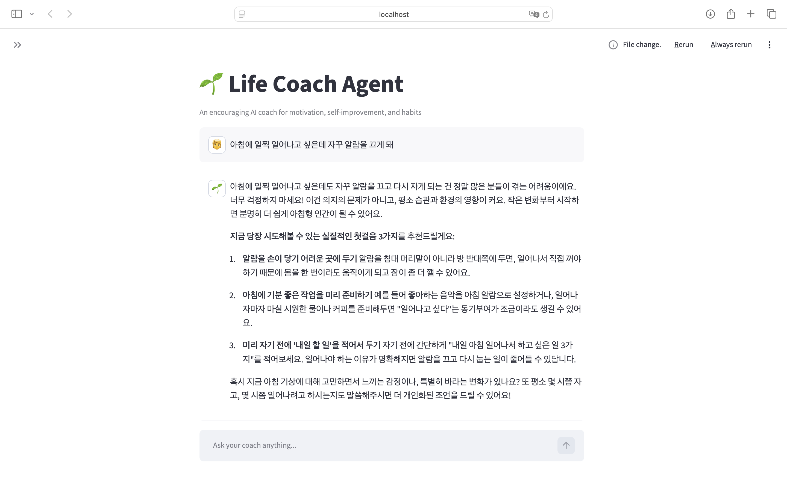
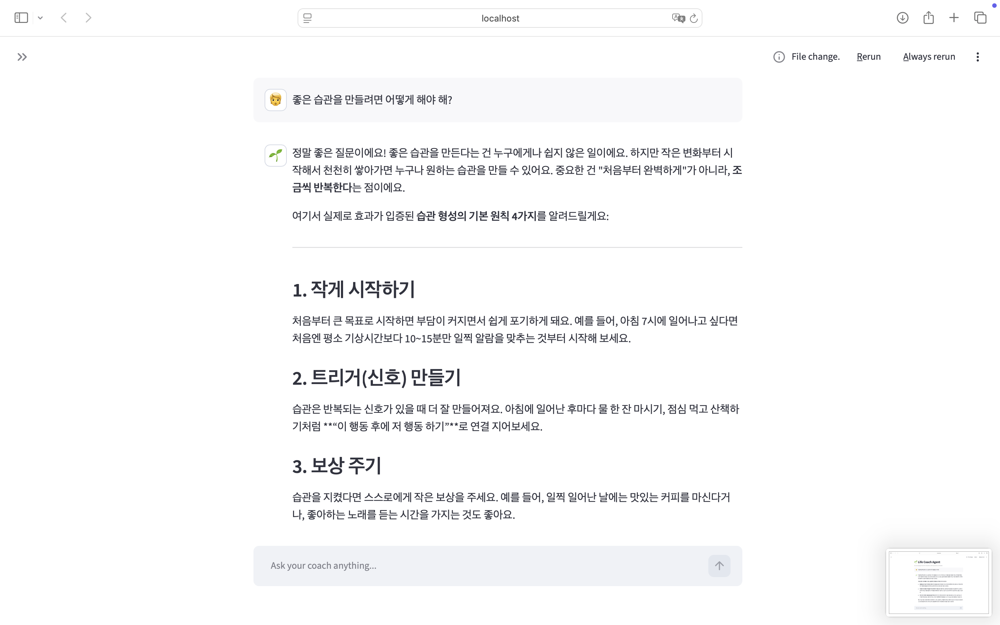

# 🌱 Life Coach Agent

Streamlit 기반 채팅 UI와 OpenAI Agents SDK로 만든 라이프 코치 챗봇입니다.
동기부여, 자기계발, 습관 형성에 대한 조언을 웹 검색을 통해 근거 있게 제공하고,
대화 내용을 SQLite에 저장해 이전 맥락을 기억합니다.

## 주요 기능

- **Streamlit 채팅 인터페이스**: `st.chat_input`, `st.chat_message`로 구현한 대화형 UI
- **OpenAI Agents SDK (Agent + Runner)**: 에이전트 정의와 실행을 SDK로 처리
- **웹 검색 도구**: 내장 `WebSearchTool`로 동기부여 콘텐츠, 자기계발 팁, 습관 형성 전략을 검색
- **세션 메모리 (SQLite)**: `SQLiteSession`을 사용해 대화 기록을 `coach_memory.db`에 자동 저장/조회
- **라이프 코치 페르소나**: 항상 한국어로, 격려하는 어조로 응답하며 구체적인 실천 방법을 제안

## 프로젝트 구조

```
.
├── app.py              # Streamlit 앱 (메인 로직)
├── main.py             # `uv run main.py`용 진입점 (내부적으로 streamlit run 실행)
├── requirements.txt    # 의존성 목록
├── .env.example         # 환경변수 템플릿
├── .gitignore           # .env, SQLite DB 파일 등 제외
└── docs/
    └── images/          # README용 스크린샷
        ├── search_demo1.png
        └── search_demo2.png
```

## 실행 결과

웹 검색을 통해 조언을 제공하는 모습:




## 시작하기

### 1. 의존성 설치

```bash
pip install -r requirements.txt
# 또는 uv 사용 시
uv sync
```

### 2. API 키 설정

`.env.example`을 복사해 `.env` 파일을 만들고 OpenAI API 키를 입력합니다.

```bash
cp .env.example .env
```

```
OPENAI_API_KEY=sk-your-key-here
```

`.env`가 없는 경우에는 앱 사이드바에서 직접 키를 입력할 수 있지만(보조 수단),
일반적인 사용에는 `.env` 방식을 권장합니다.

### 3. 앱 실행

```bash
uv run main.py
# 또는
streamlit run app.py
```

브라우저에서 `http://localhost:8501`로 접속하면 됩니다.

## 참고

- 웹 검색(`WebSearchTool`)은 Responses API를 지원하는 모델(`gpt-4.1`, `gpt-4o` 계열)이 필요합니다.
- 대화 기록은 로컬 SQLite 파일(`coach_memory.db`)에 저장되며, 사이드바의 "Clear conversation" 버튼으로 초기화할 수 있습니다.
